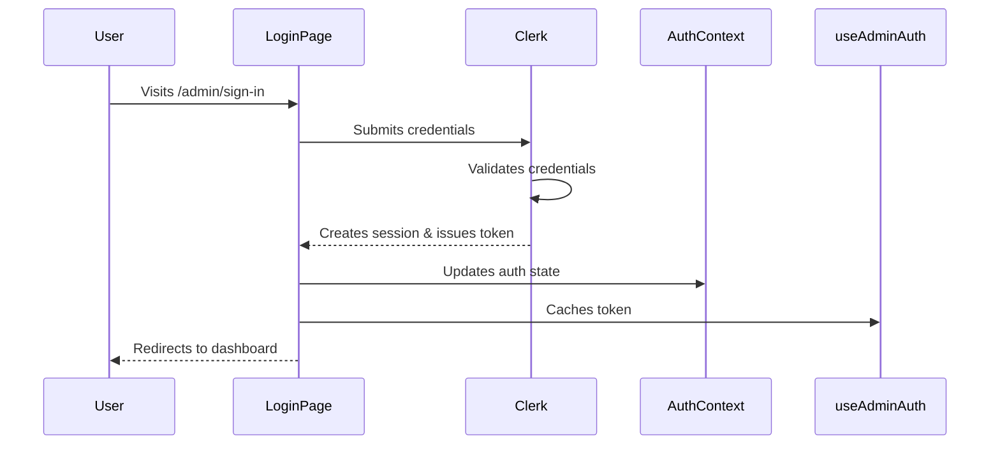
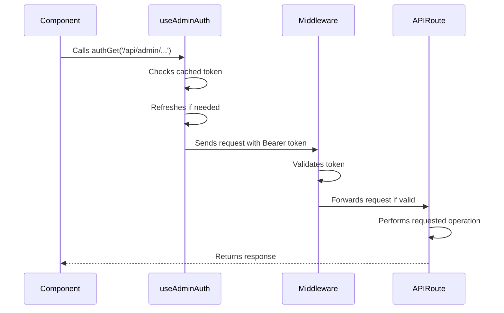
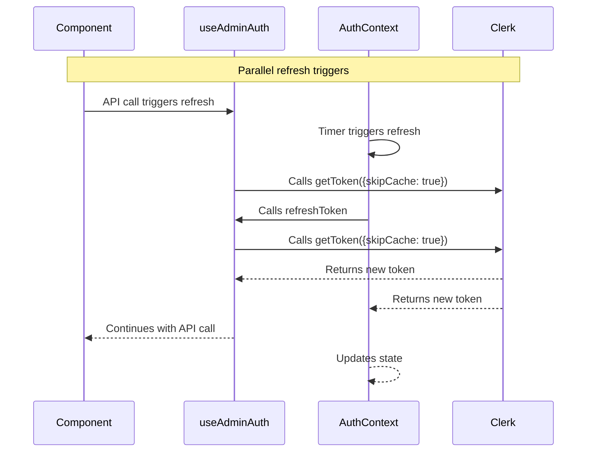
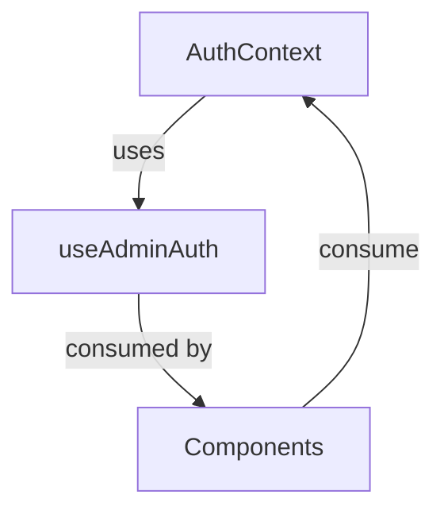
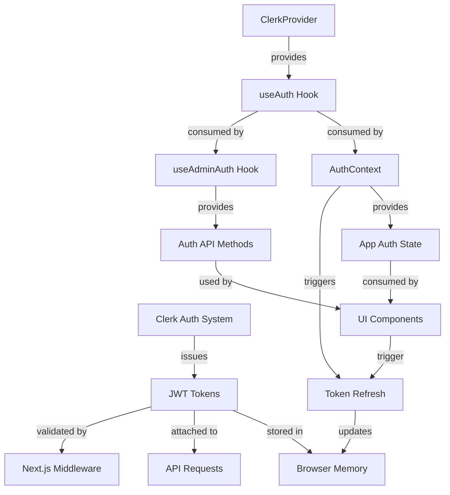

# Authentication System Architecture Documentation

## Overview

This document describes the current authentication architecture of the Hoitohuone Zenni booking system. Understanding this architecture is crucial before implementing the planned fixes outlined in the authentication-fix-plan.md document.

## Technology Stack

- **Identity Provider**: Clerk (https://clerk.dev)
- **Framework**: Next.js (App Router)
- **Client State Management**: React Context + Custom Hooks
- **Server Protection**: Next.js Middleware

## Components of the Authentication System

### 1. Clerk Integration

#### ClerkProvider
Located in `src/app/layout.tsx`, the ClerkProvider wraps the entire application and provides authentication services:

```tsx
<ClerkProvider>
  {/* Application components */}
</ClerkProvider>
```

Clerk manages:
- User sessions
- Sign-in/sign-up flows
- JWT token issuance
- Session persistence

#### Clerk Authentication Hook
The `useAuth` hook from Clerk provides authentication state and methods:

```tsx
const { getToken, isSignedIn, isLoaded } = useAuth();
```

### 2. Custom Auth Context

#### AuthContext Provider
Located in `src/contexts/AuthContext.tsx`, this provider creates an application-wide authentication context:

```tsx
<AuthProvider>
  {/* Application components that need auth state */}
</AuthProvider>
```

The provider:
- Wraps the Clerk authentication
- Adds custom state like `isAuthenticated`, `isLoading`, etc.
- Provides a refresh mechanism via `refreshAuth`
- Tracks token expiration through `hasTokenExpired`

#### AuthContext Consumer
Components consume this context through the `useAuthContext` hook:

```tsx
const { isAuthenticated, isLoading, refreshAuth } = useAuthContext();
```

### 3. useAdminAuth Hook

Located in `src/hooks/useAdminAuth.tsx`, this is a specialized hook for administrative authentication:

```tsx
const { authGet, authPost, isAuthError, refreshToken } = useAdminAuth();
```

The hook provides:
- Token caching and management
- Expiry tracking
- Authenticated fetch methods (`authGet`, `authPost`, etc.)
- Refresh mechanism
- Error handling

> **Issue**: Both AuthContext and useAdminAuth implement similar functionality with different state management, leading to synchronization problems.

### 4. Server-Side Authentication

#### Next.js Middleware
Located in `src/middleware.ts`, the middleware protects routes on the server side:

```tsx
export default clerkMiddleware(async (auth, req) => {
  // Auth protection logic
});
```

The middleware:
- Protects admin routes
- Handles API authentication
- Redirects unauthenticated users
- Supports both Clerk tokens and API keys

#### API Route Protection
API routes implement their own authentication checks, typically using:

```tsx
const auth = getAuth(request);
if (!auth.userId) {
  return new NextResponse(
    JSON.stringify({ error: "Unauthorized" }),
    { status: 401 }
  );
}
```

## Authentication Flows

### 1. Initial Authentication



### 2. API Request Flow



### 3. Token Refresh Flow



## Current Issues

### 1. Circular Dependencies



### 2. Token Refresh Storms

Multiple independent refresh mechanisms can create refresh storms:
- AuthContext auto-refresh timer
- useAdminAuth token expiry checks
- 401 response handlers
- Component-level refresh calls

### 3. Inconsistent Cookie Handling

- Clerk relies on cookies for session management
- Not all fetch calls include credentials
- Token-based and cookie-based auth aren't properly synchronized

### 4. Error Handling Gaps

- Inconsistent error handling across components
- Refresh failures can cause cascading errors
- UI doesn't always reflect authentication state

## Relevant Code Snippets

### AuthContext Definition

```tsx
// src/contexts/AuthContext.tsx
const AuthContext = createContext<AuthContextType>({
  isAuthenticated: false,
  isLoading: true,
  refreshAuth: async () => false,
  hasTokenExpired: false,
  error: null,
  clearError: () => {},
});
```

### useAdminAuth Token Refresh

```tsx
// src/hooks/useAdminAuth.tsx
const refreshToken = useCallback(async (silent = false) => {
  // Refresh implementation with caching and expiry tracking
  const newToken = await getToken({ skipCache: true });
  setCachedToken(newToken);
  updateTokenExpiry(newToken);
  // ...
}, [getToken, updateTokenExpiry]);
```

### Middleware Auth Protection

```tsx
// src/middleware.ts
try {
  console.log('Protecting route with Clerk auth:', req.nextUrl.pathname);
  await auth.protect();
  console.log('Auth protection passed for:', req.nextUrl.pathname);
} catch (error) {
  console.error('Auth protection failed:', error);
  // Handle failure...
}
```

## Authentication Data Flow Diagram



## Next Steps

After understanding the current architecture, proceed to the Authentication Fix Plan to implement the necessary changes for a more robust authentication system. 