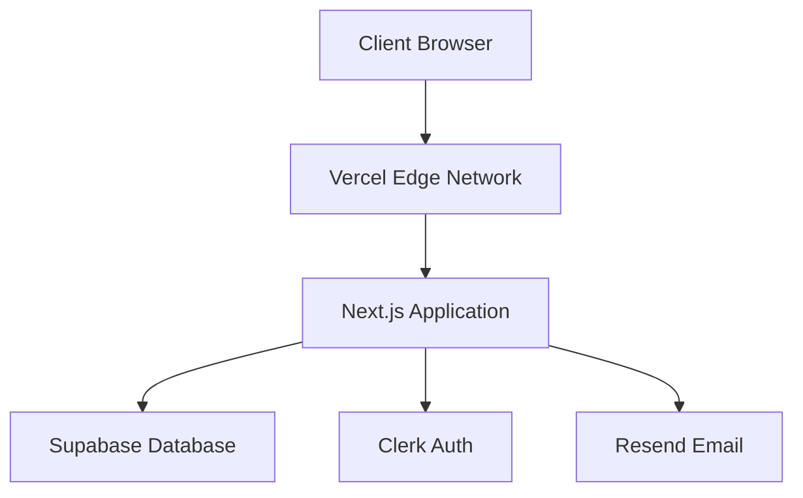

# Deployment and Scaling Plan

## Overview

This document outlines the deployment strategy and scaling considerations for the healing services booking system. It covers infrastructure setup, deployment processes, monitoring, and strategies for handling increased load.

## Infrastructure Architecture

### Cloud Provider: Vercel

#### Core Services


### Resource Requirements

| Component | Initial Spec | Scaled Spec |
|-----------|-------------|-------------|
| Database | Supabase Free Tier | Supabase Pro |
| Hosting | Vercel Hobby | Vercel Pro |
| Auth | Clerk Free | Clerk Team |
| Email | Resend Free | Resend Pro |

## Deployment Strategy

### Environments

#### Development
```env
# Development Environment
NEXT_PUBLIC_VERCEL_ENV=development
DATABASE_URL=dev-database-url
NEXT_PUBLIC_CLERK_PUBLISHABLE_KEY=dev-clerk-key
RESEND_API_KEY=dev-resend-key
```

#### Staging
```env
# Staging Environment
NEXT_PUBLIC_VERCEL_ENV=preview
DATABASE_URL=staging-database-url
NEXT_PUBLIC_CLERK_PUBLISHABLE_KEY=staging-clerk-key
RESEND_API_KEY=staging-resend-key
```

#### Production
```env
# Production Environment
NEXT_PUBLIC_VERCEL_ENV=production
DATABASE_URL=prod-database-url
NEXT_PUBLIC_CLERK_PUBLISHABLE_KEY=prod-clerk-key
RESEND_API_KEY=prod-resend-key
```

### Deployment Process

#### 1. Continuous Deployment
```yaml
# .github/workflows/deploy.yml
name: Deploy
on:
  push:
    branches: [main]
  pull_request:
    branches: [main]

jobs:
  deploy:
    runs-on: ubuntu-latest
    steps:
      - uses: actions/checkout@v2
      - name: Install dependencies
        run: npm ci
      - name: Run tests
        run: npm test
      - name: Deploy to Vercel
        run: vercel --prod
        env:
          VERCEL_TOKEN: ${{ secrets.VERCEL_TOKEN }}
```

#### 2. Database Migrations
```typescript
// src/lib/db-migrate.ts
import { migrate } from '@prisma/migrate';

export async function runMigrations() {
  await migrate.deploy({
    schema: './prisma/schema.prisma'
  });
}
```

#### 3. Rollback Strategy
```typescript
// src/lib/rollback.ts
export async function rollbackDeployment(version: string) {
  // Revert application version
  await revertApplicationVersion(version);
  
  // Rollback database if needed
  await rollbackDatabase(version);
  
  // Notify team
  await notifyTeam('Deployment rolled back to ' + version);
}
```

## Scaling Strategy

### 1. Application Scaling

#### Serverless Functions
```typescript
// next.config.js
module.exports = {
  experimental: {
    serverActions: true,
  },
  async headers() {
    return [
      {
        source: '/api/:path*',
        headers: [
          { key: 'Access-Control-Allow-Origin', value: '*' },
          { key: 'Cache-Control', value: 's-maxage=60, stale-while-revalidate' }
        ],
      },
    ]
  },
}
```

#### Edge Caching
```typescript
// src/app/api/availability/route.ts
import { NextResponse } from 'next/server';

export async function GET() {
  const data = await getAvailability();
  
  return new NextResponse(JSON.stringify(data), {
    headers: {
      'Cache-Control': 'public, s-maxage=60, stale-while-revalidate=600'
    }
  });
}
```

### 2. Database Scaling

#### Connection Pooling
```typescript
// src/lib/prisma.ts
import { Pool } from '@neondatabase/serverless';

const pool = new Pool({
  connectionString: process.env.DATABASE_URL,
  maxConnections: 20
});
```

#### Query Optimization
```typescript
// src/lib/booking.ts
export async function getBookings() {
  return await prisma.booking.findMany({
    select: {
      id: true,
      date: true,
      customer: {
        select: {
          name: true,
          email: true
        }
      }
    },
    take: 50,
    orderBy: {
      date: 'desc'
    }
  });
}
```

### 3. Caching Strategy

#### Redis Implementation
```typescript
// src/lib/cache.ts
import { Redis } from '@upstash/redis';

const redis = new Redis({
  url: process.env.REDIS_URL,
  token: process.env.REDIS_TOKEN
});

export async function cacheData(key: string, data: any, ttl = 3600) {
  await redis.set(key, JSON.stringify(data), { ex: ttl });
}

export async function getCachedData(key: string) {
  const data = await redis.get(key);
  return data ? JSON.parse(data as string) : null;
}
```

## Monitoring and Alerts

### 1. Performance Monitoring

#### Application Metrics
```typescript
// src/lib/monitoring.ts
export async function trackMetrics(metric: {
  name: string;
  value: number;
  tags?: Record<string, string>;
}) {
  await fetch('/api/metrics', {
    method: 'POST',
    body: JSON.stringify(metric)
  });
}
```

#### Database Monitoring
```sql
-- monitoring/slow-queries.sql
SELECT 
  query,
  calls,
  total_exec_time,
  mean_exec_time
FROM pg_stat_statements
ORDER BY total_exec_time DESC
LIMIT 10;
```

### 2. Error Tracking

#### Error Reporting
```typescript
// src/lib/error-tracking.ts
export function reportError(error: Error, context?: any) {
  console.error('Error:', error);
  
  // Send to error tracking service
  fetch('/api/errors', {
    method: 'POST',
    body: JSON.stringify({
      message: error.message,
      stack: error.stack,
      context
    })
  });
}
```

### 3. Health Checks

#### API Health Check
```typescript
// src/app/api/health/route.ts
export async function GET() {
  const health = {
    database: await checkDatabaseConnection(),
    cache: await checkCacheConnection(),
    email: await checkEmailService()
  };

  const status = Object.values(health).every(h => h.status === 'ok')
    ? 200
    : 503;

  return new Response(JSON.stringify(health), { status });
}
```

## Load Testing

### 1. Load Test Scenarios
```typescript
// tests/load/booking-flow.ts
import { check } from 'k6';
import http from 'k6/http';

export const options = {
  scenarios: {
    peak_load: {
      executor: 'ramping-arrival-rate',
      startRate: 0,
      timeUnit: '1s',
      preAllocatedVUs: 50,
      maxVUs: 100,
      stages: [
        { duration: '5m', target: 50 },
        { duration: '10m', target: 50 },
        { duration: '5m', target: 0 }
      ]
    }
  }
};
```

## Backup Strategy

### 1. Database Backups
```typescript
// scripts/backup.ts
import { exec } from 'child_process';

async function createBackup() {
  const date = new Date().toISOString().split('T')[0];
  const filename = `backup-${date}.sql`;
  
  await exec(
    `pg_dump ${process.env.DATABASE_URL} > backups/${filename}`
  );
  
  // Upload to secure storage
  await uploadToStorage(`backups/${filename}`);
}
```

### 2. Application State
```typescript
// src/lib/state-backup.ts
export async function backupApplicationState() {
  const state = {
    services: await prisma.service.findMany(),
    settings: await prisma.settings.findMany(),
    blockedDates: await prisma.blockedDate.findMany()
  };
  
  await uploadToStorage('app-state.json', JSON.stringify(state));
}
```

## Scaling Thresholds

### Traffic Thresholds
| Metric | Threshold | Action |
|--------|-----------|--------|
| Concurrent Users | > 100 | Scale serverless functions |
| Database Connections | > 80% | Increase connection pool |
| Response Time | > 500ms | Enable additional caching |
| Error Rate | > 1% | Alert and investigate |

### Resource Thresholds
| Resource | Threshold | Action |
|----------|-----------|--------|
| Database CPU | > 70% | Scale database |
| Memory Usage | > 80% | Investigate memory leaks |
| Storage | > 80% | Increase storage capacity |
| Cache Hit Rate | < 80% | Optimize caching strategy |

## Disaster Recovery

### Recovery Time Objectives (RTO)
- Critical Systems: 1 hour
- Non-Critical Systems: 4 hours

### Recovery Point Objectives (RPO)
- Database: 5 minutes
- Application State: 1 hour
- User Data: 24 hours

### Recovery Procedures
1. Assess the outage scope
2. Restore from latest backup
3. Verify data integrity
4. Run system health checks
5. Resume operations

## Security Measures

### SSL Configuration
```typescript
// next.config.js
module.exports = {
  async headers() {
    return [
      {
        source: '/:path*',
        headers: [
          {
            key: 'Strict-Transport-Security',
            value: 'max-age=31536000; includeSubDomains'
          },
          {
            key: 'X-Content-Type-Options',
            value: 'nosniff'
          }
        ],
      },
    ]
  },
}
```

### Rate Limiting
```typescript
// src/middleware.ts
import { rateLimit } from '@/lib/rate-limit';

export async function middleware(req: Request) {
  // Apply rate limiting to API routes
  if (req.url.includes('/api/')) {
    const ip = req.headers.get('x-forwarded-for');
    const limit = await rateLimit(ip);
    
    if (!limit.success) {
      return new Response('Too Many Requests', { status: 429 });
    }
  }
}
```

## Documentation

### Deployment Documentation
- Setup instructions
- Environment configuration
- Deployment procedures
- Rollback procedures

### Monitoring Documentation
- Metrics definitions
- Alert thresholds
- Response procedures
- Escalation paths

### Scaling Documentation
- Scaling triggers
- Resource allocation
- Performance optimization
- Cost considerations 