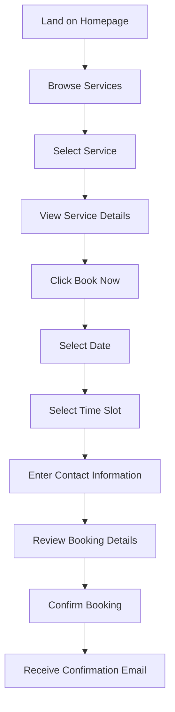
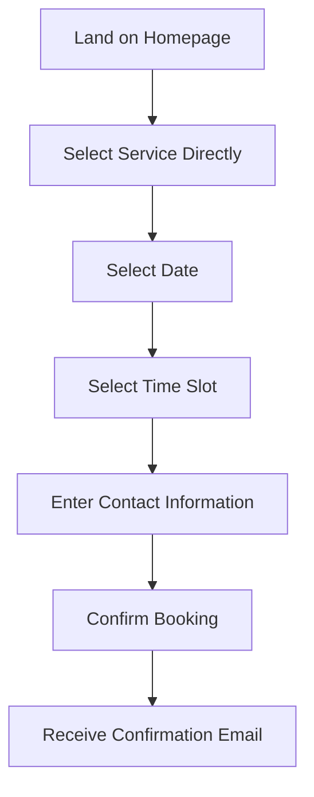
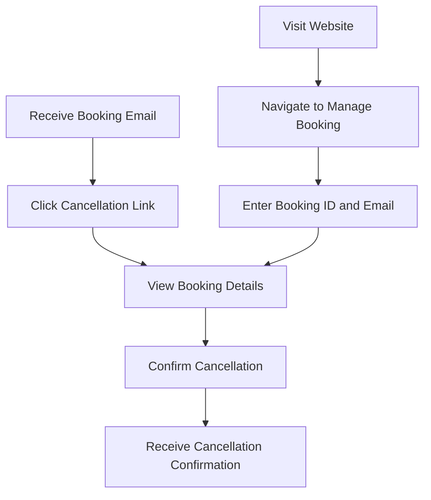
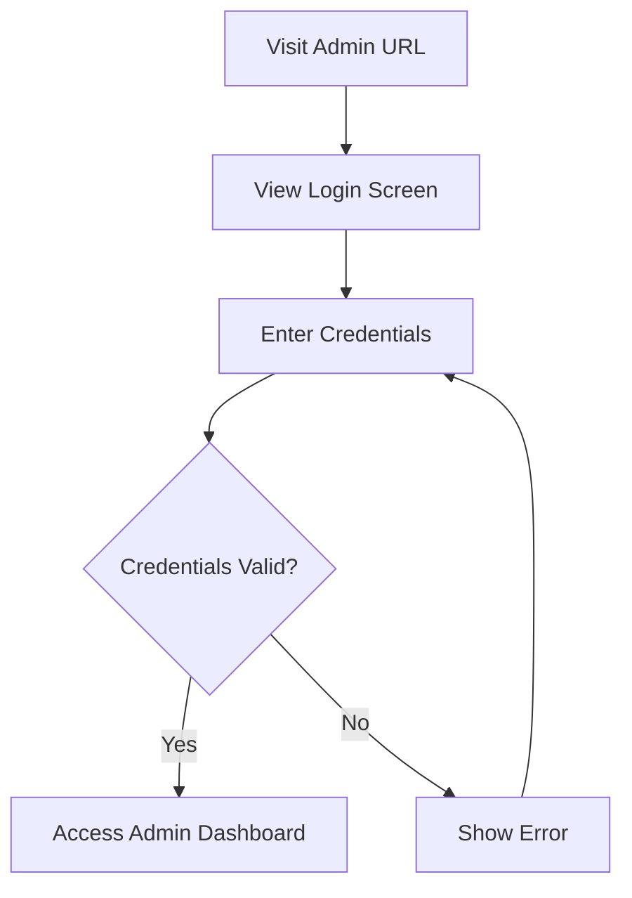
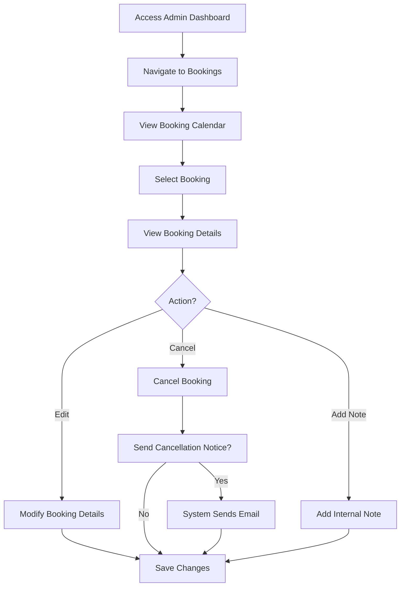
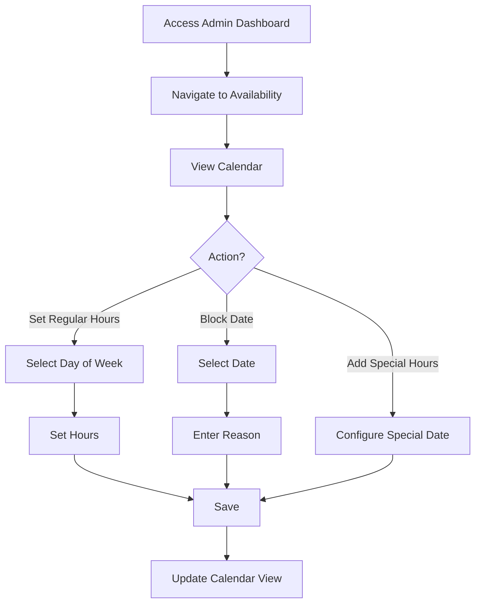
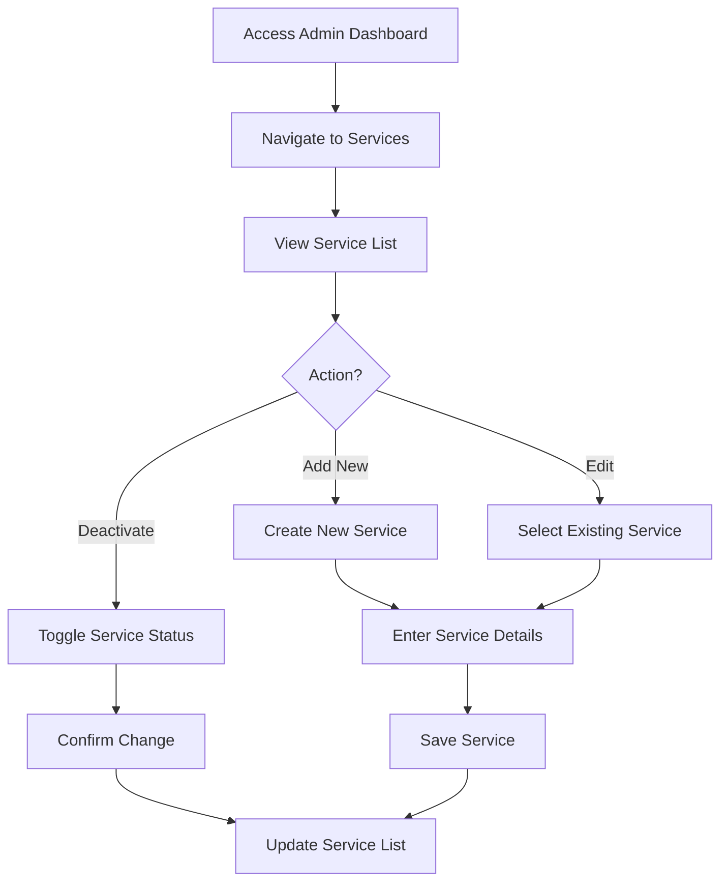
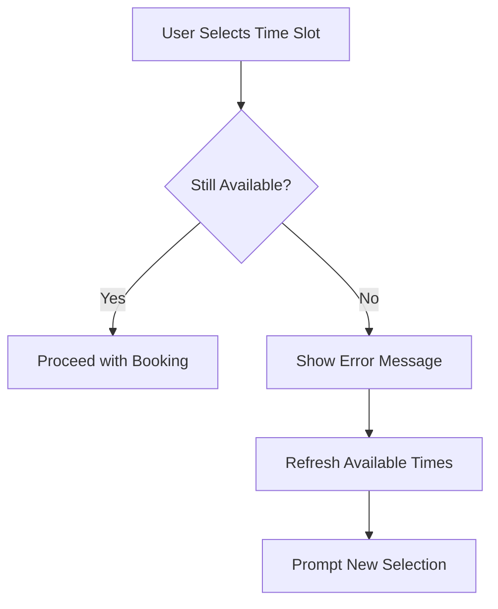
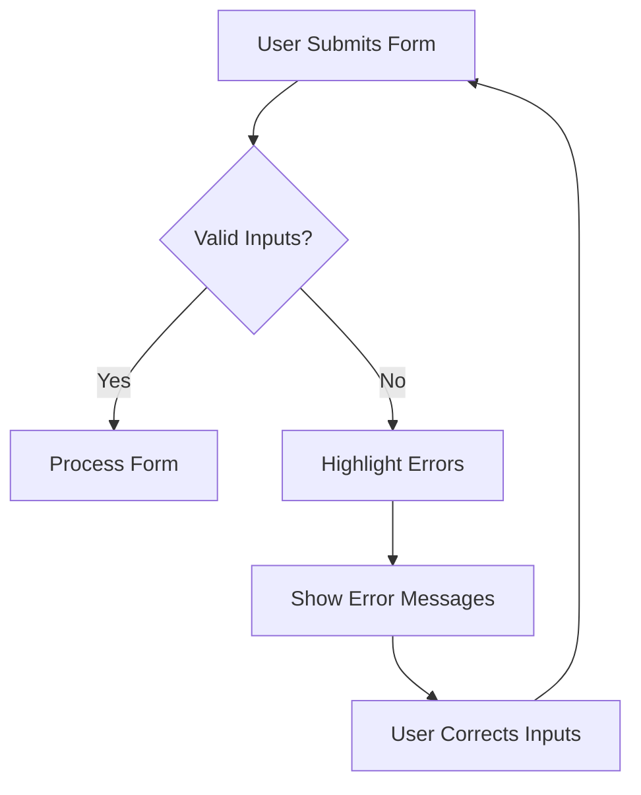
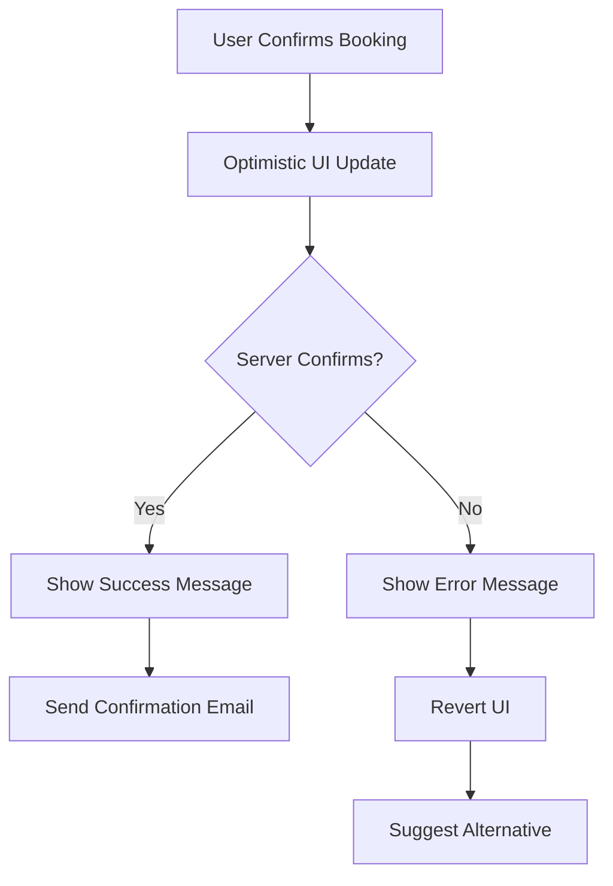

# User Flow Documentation

## 1. Overview

This document outlines the user flows and customer journeys for the healing services booking system. It maps the step-by-step processes that different user personas will follow when interacting with the system.

## 2. User Personas

### 2.1 First-time Visitor
A new client discovering the healing services for the first time. They need clear guidance and sufficient information to make a booking decision.

### 2.2 Returning Customer 
A repeat client who has used the services before and is familiar with the booking process. They value efficiency and minimal steps.

### 2.3 Admin User
The service provider or staff member who manages bookings, availability, and service offerings through the admin dashboard.

### 2.4 Cancellation Flow User
A customer who needs to cancel or modify their existing booking.

## 3. Client Booking Flows

### 3.1 First-time Visitor Journey

#### Detailed Steps:

1. **Land on Homepage**
   - User arrives at the website
   - Views introduction to healing services
   - Sees prominent "Book Now" or "Services" navigation

2. **Browse Services**
   - User views list of available services
   - Each service shows brief description, duration, and price
   - Services are clearly categorized

3. **Select Service**
   - User clicks on service of interest
   - System highlights the selected service

4. **View Service Details**
   - User reads comprehensive service description
   - Views benefits and what to expect
   - Sees duration and pricing information

5. **Click Book Now**
   - User decides to book and clicks "Book Now" button
   - System transitions to booking interface

6. **Select Date**
   - Calendar view displays available dates
   - Unavailable dates are clearly marked/disabled
   - User selects preferred date

7. **Select Time Slot**
   - Available time slots for selected date are displayed
   - Time slots are shown in 15-minute intervals
   - User selects preferred time

8. **Enter Contact Information**
   - User provides name, email address
   - Optional phone number
   - Optional notes or special requests
   - Selects preferred language (English/Finnish)

9. **Review Booking Details**
   - Summary of selected service, date, time
   - User's contact information
   - Cancellation policy information

10. **Confirm Booking**
    - User clicks "Confirm Booking" button
    - System shows loading indicator
    - Optimistic UI updates to show booking as tentative

11. **Receive Confirmation Email**
    - System sends confirmation email with booking details
    - Email includes cancellation link
    - Booking is finalized in the system

#### Error Paths:

- **Time Slot No Longer Available**: If another user books the same slot during selection, user receives clear error message and is prompted to select another time
- **Invalid Contact Information**: Form validation highlights errors and provides guidance
- **System Error**: Error message with option to try again or contact support

### 3.2 Returning Customer Journey

The returning customer journey follows a similar path but is streamlined with fewer exploratory steps. The system could eventually be enhanced to remember previous customers' information to further simplify the process.

### 3.3 Cancellation Flow

#### Detailed Steps:

1. **Access Cancellation**
   - Via unique cancellation link in confirmation email, OR
   - Via "Manage Booking" section on the website (enters booking ID and email)

2. **View Booking Details**
   - System displays booking information for verification
   - Shows service, date, time, and cancellation policy

3. **Confirm Cancellation**
   - User clicks "Cancel Booking" button
   - System asks for confirmation

4. **Receive Cancellation Confirmation**
   - System confirms cancellation on screen
   - Sends cancellation confirmation email
   - Frees up the time slot for other bookings

## 4. Admin User Flows

### 4.1 Admin Login Journey

### 4.2 Managing Bookings

#### Detailed Steps:

1. **Access Admin Dashboard**
   - Admin logs in via Clerk authentication
   - System displays dashboard overview with upcoming bookings

2. **Navigate to Bookings**
   - Admin clicks on Bookings section
   - System loads booking management interface

3. **View Booking Calendar**
   - Calendar view shows all bookings
   - Different colors indicate booking status
   - Admin can filter by date range, service, or status

4. **Select Booking**
   - Admin clicks on a specific booking
   - System loads booking details

5. **View Booking Details**
   - Full customer information
   - Service, date, time details
   - Status and history

6. **Actions**
   - **Edit Booking**: Modify details (time, service, customer info)
   - **Cancel Booking**: Cancel with option to notify customer
   - **Add Note**: Add internal notes not visible to customer

7. **Save Changes**
   - System updates booking in database
   - Confirms changes to admin

### 4.3 Managing Availability

#### Detailed Steps:

1. **Access Availability Settings**
   - Admin navigates to Availability section
   - System displays calendar view of current availability

2. **Manage Regular Hours**
   - Select day of week
   - Set start and end times
   - Set as available or unavailable
   - Apply to recurring weekly schedule

3. **Block Dates**
   - Select specific date(s) to block
   - Enter reason for blocking (e.g., holiday, personal day)
   - Save blocked dates

4. **Set Special Hours**
   - Select specific date for special hours
   - Set custom hours different from regular schedule
   - Save special availability

### 4.4 Managing Services

#### Detailed Steps:

1. **Access Services Section**
   - Admin navigates to Services management
   - System displays list of all services

2. **Add New Service**
   - Click "Add Service" button
   - Enter service details:
     - Name (default, English, Finnish)
     - Description (default, English, Finnish)
     - Duration
     - Price
     - Color for calendar display
     - Display order

3. **Edit Existing Service**
   - Select service from list
   - Modify any details
   - Save changes

4. **Deactivate Service**
   - Toggle active status
   - Service remains in system but is not bookable
   - Confirm change

## 5. Decision Points and System Responses

### 5.1 Availability Conflicts

### 5.2 Form Validation

### 5.3 Booking Confirmation

## 6. Integration Touchpoints

### 6.1 Email Notifications

- **Booking Confirmation**: Sent immediately after successful booking
- **Booking Reminder**: Sent 24 hours before appointment (optional)
- **Booking Cancellation**: Sent after customer or admin cancels
- **Admin Notifications**: Sent to admin when new bookings are made

### 6.2 External Calendar Integration

- Future consideration for exporting bookings to external calendars (iCal, Google Calendar)
- Integration with admin's personal calendar system

## 7. Success Metrics and Monitoring

### 7.1 Conversion Funnel

Track user progression through booking steps:
1. Service view → Date selection: __% continue
2. Date selection → Time selection: __% continue
3. Time selection → Contact info: __% continue
4. Contact info → Confirmation: __% complete

### 7.2 Drop-off Points

Monitor where users abandon the booking process to identify potential UX issues:
- Identify highest drop-off pages
- Measure time spent on each step
- Track form validation errors

## 8. Future Flow Enhancements

- **User Accounts**: Allow returning customers to create accounts and save preferences
- **Online Payments**: Add payment flow for deposits or full payments
- **Multi-service Bookings**: Enable booking multiple services in sequence
- **Recurring Bookings**: Allow setting up regular recurring appointments 